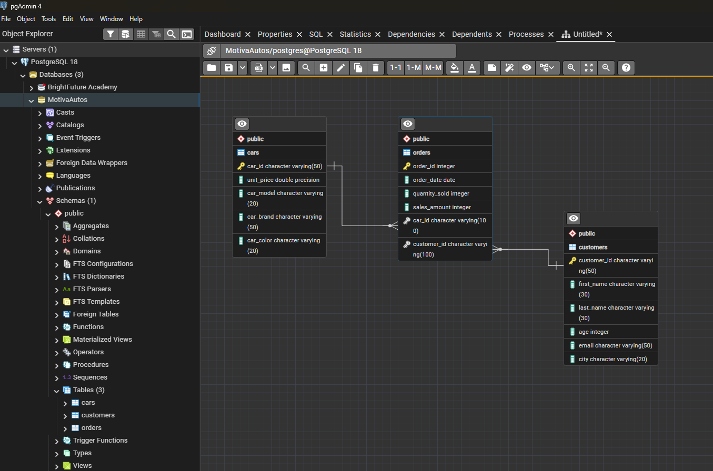
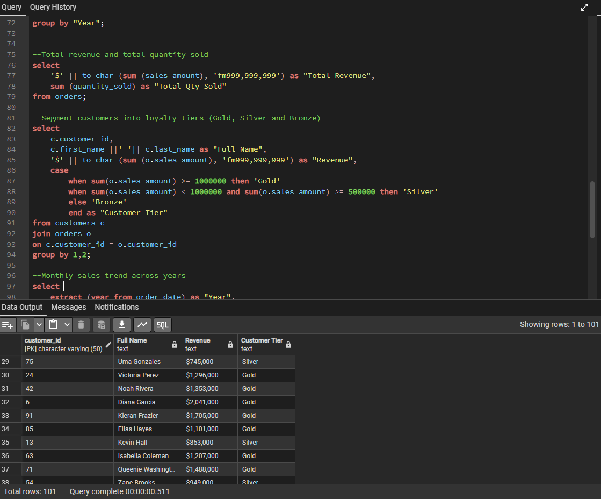
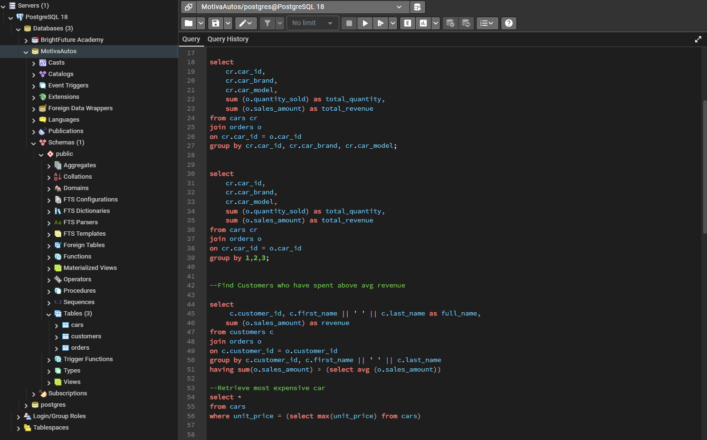

# 🚘 MotivaAutos — Automotive Sales SQL Analysis (PostgreSQL)

> A structured SQL analysis project built on a custom PostgreSQL database, exploring automotive sales performance, customer revenue segmentation, and product-level insights using analytical queries.

---

## 📌 Project Overview

MotivaAutos is a relational PostgreSQL database designed to model an automotive dealership's sales operations. The project covers database design (ERD and schema creation), data population, and a suite of analytical SQL queries answering real business questions about customers, cars, and orders.

**Business questions answered:**
- Which car brands and models generate the highest revenue and volume?
- Who are the top-spending customers — and how do they segment by loyalty tier?
- Which customers spend above average?
- What is the most expensive car in the inventory?
- How do monthly sales trends look across years?
- What is the total revenue and total quantity sold across all orders?

---

## 🗄️ Database Schema

### Entity Relationship Diagram (ERD)


The database contains **3 tables** in the `public` schema, running on **PostgreSQL 18**:

### `cars`
| Column | Type | Description |
|---|---|---|
| `car_id` | VARCHAR | Primary key — unique car identifier |
| `unit_price` | DOUBLE PRECISION | Price per unit |
| `car_model` | VARCHAR | Model name |
| `car_brand` | VARCHAR | Manufacturer / brand |
| `car_color` | VARCHAR | Vehicle colour |

### `customers`
| Column | Type | Description |
|---|---|---|
| `customer_id` | VARCHAR | Primary key — unique customer identifier |
| `first_name` | VARCHAR | Customer first name |
| `last_name` | VARCHAR | Customer last name |
| `age` | INTEGER | Customer age |
| `email` | VARCHAR | Contact email |
| `city` | VARCHAR | Customer city |

### `orders`
| Column | Type | Description |
|---|---|---|
| `order_id` | INTEGER | Primary key — unique order identifier |
| `order_date` | DATE | Date the order was placed |
| `quantity_sold` | INTEGER | Number of units sold |
| `sales_amount` | INTEGER | Total sales value for the order |
| `car_id` | VARCHAR | Foreign key → cars.car_id |
| `customer_id` | VARCHAR | Foreign key → customers.customer_id |

**Relationships:**
- `cars` → `orders` (one-to-many on `car_id`)
- `customers` → `orders` (one-to-many on `customer_id`)

---

## 🔍 Analytical Queries

### Query Screenshots



### Queries Included

**1. Total Revenue and Total Quantity Sold**
```sql
select
    '$' || to_char(sum(sales_amount), 'fm999,999,999') as "Total Revenue",
    sum(quantity_sold) as "Total Qty Sold"
from orders;
```

**2. Customer Loyalty Tier Segmentation (Gold / Silver / Bronze)**
```sql
select
    c.customer_id,
    c.first_name || ' ' || c.last_name as "Full Name",
    '$' || to_char(sum(o.sales_amount), 'fm999,999,999') as "Revenue",
    case
        when sum(o.sales_amount) >= 1000000 then 'Gold'
        when sum(o.sales_amount) < 1000000 and sum(o.sales_amount) >= 500000 then 'Silver'
        else 'Bronze'
    end as "Customer Tier"
from customers c
join orders o on c.customer_id = o.customer_id
group by 1, 2;
```
> *Result: 101 customers segmented into Gold (≥$1M), Silver ($500K–$999K), and Bronze (<$500K) tiers.*

**3. Total Sales by Car Brand and Model**
```sql
select
    cr.car_id,
    cr.car_brand,
    cr.car_model,
    sum(o.quantity_sold) as total_quantity,
    sum(o.sales_amount) as total_revenue
from cars cr
join orders o on cr.car_id = o.car_id
group by cr.car_id, cr.car_brand, cr.car_model;
```

**4. Customers Who Spent Above Average Revenue (HAVING + Subquery)**
```sql
select
    c.customer_id,
    c.first_name || ' ' || c.last_name as full_name,
    sum(o.sales_amount) as revenue
from customers c
join orders o on c.customer_id = o.customer_id
group by c.customer_id, c.first_name || ' ' || c.last_name
having sum(o.sales_amount) > (select avg(o.sales_amount) from orders o);
```

**5. Most Expensive Car (Subquery)**
```sql
select *
from cars
where unit_price = (select max(unit_price) from cars);
```

**6. Monthly Sales Trend Across Years**
```sql
select
    extract(year from order_date) as "Year",
    -- month and sales aggregation
group by "Year";
```

---

## 🛠️ Tools & Techniques

- **PostgreSQL 18** — relational database engine
- **pgAdmin 4** — database design, ERD generation, query execution
- **SQL techniques used:**
  - `JOIN` — inner joins across cars, customers, and orders tables
  - `GROUP BY` — aggregation by customer, car brand/model, and time period
  - `CASE` statement — conditional loyalty tier segmentation (Gold / Silver / Bronze)
  - `HAVING` — post-aggregation filtering (above-average spenders)
  - Scalar **subqueries** — max unit price lookup, average revenue comparison
  - `EXTRACT()` — date part extraction for monthly/yearly trend analysis
  - `to_char()` — formatted currency output with thousand separators
  - String concatenation (`||`) — full name construction from first and last name fields
- **ERD** — entity relationship diagram documenting table structure and foreign key relationships

---

## 💡 Key Findings

- **101 customers** were segmented across loyalty tiers — Gold customers (≥$1M spend) include Victoria Perez ($1,296,000), Noah Rivera ($1,353,000), Diana Garcia ($2,041,000), and others, representing the highest-value accounts to prioritise for retention
- **Diana Garcia is the top customer** at $2,041,000 — more than 50% above the next Gold tier customer, making her a key account risk if churned
- **Silver tier customers** (e.g. Uma Gonzales at $745,000) are close to Gold threshold — targeted promotions could convert them and increase revenue concentration in the top tier
- **HAVING + subquery pattern** efficiently surfaces above-average spenders without requiring a separate CTE or temp table — a clean, single-pass approach
- **The most expensive car query** demonstrates correlated subquery logic useful for inventory pricing benchmarks and floor-price policy setting
- **Monthly trend analysis** enables seasonal demand planning — pairing this with car brand/model data would reveal which models drive peak-month revenue

---

## 🔗 Project Files

**[👉 View full SQL script on GitHub]()**

---

## 📁 Files in This Repository

| File | Description |
|---|---|
| `motivaautos_queries.sql` | Full SQL script — schema creation, data population, and all analytical queries |
| `ERD.png` | Entity Relationship Diagram — table structure and relationships |
| `Analytic_Queries.png` | Screenshot — query code and results (Part 1) |
| `Analytic_Queries2.png` | Screenshot — query code and results (Part 2) |

---

## 👤 Author

**Divine Abbah** — Data Analyst  
📧 divineabbah7@gmail.com  
🌐 [Portfolio](https://divineabbah77.netlify.app) · [LinkedIn](https://linkedin.com/in/divineabbah)
